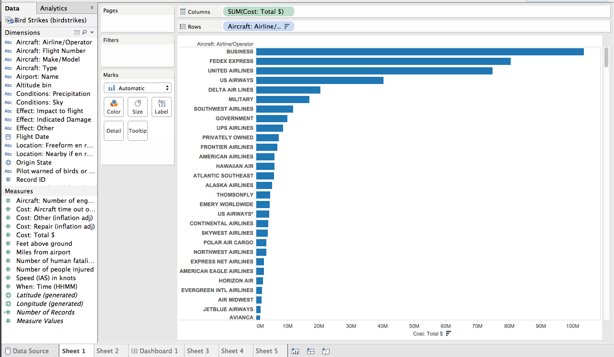
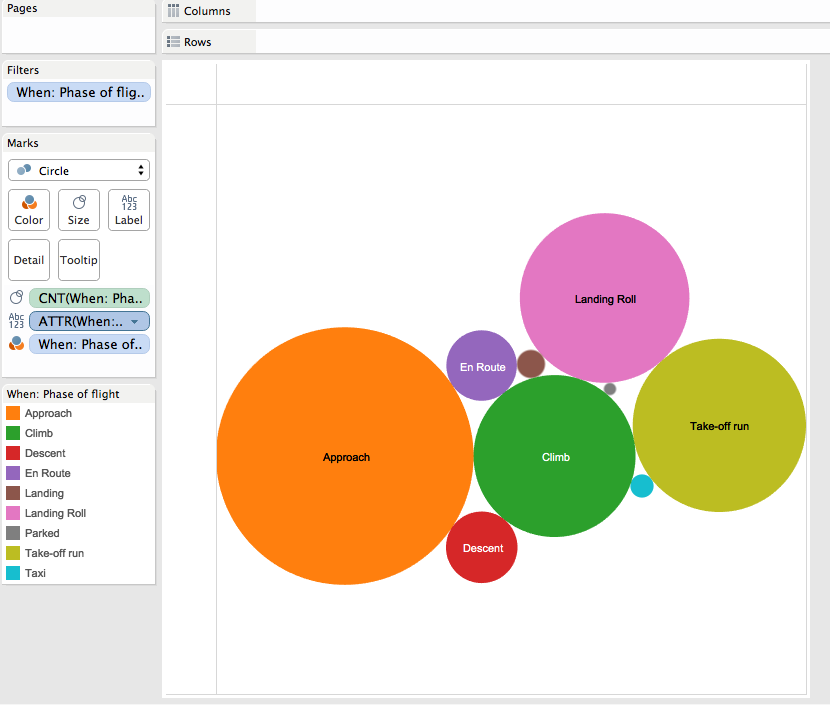
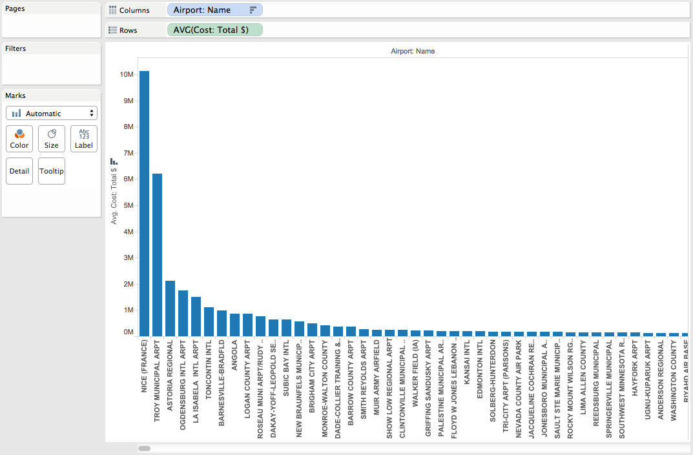
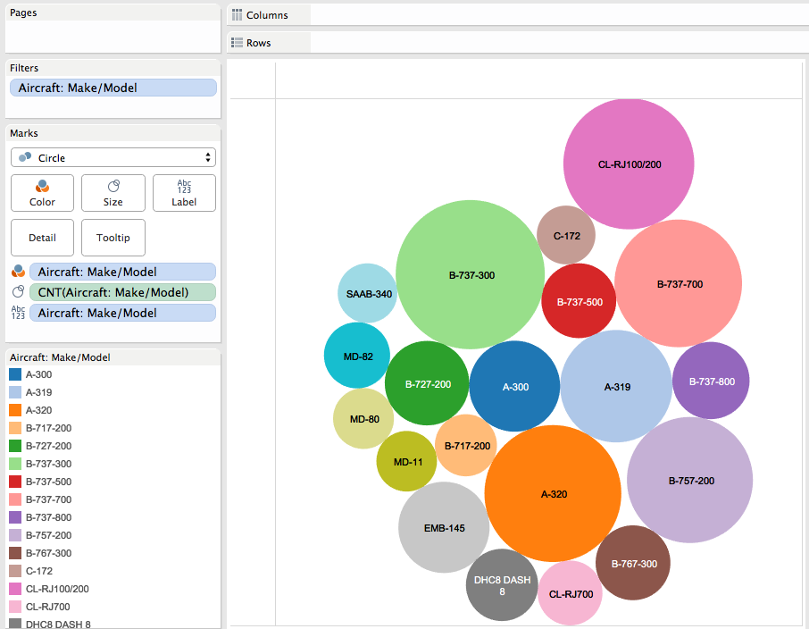
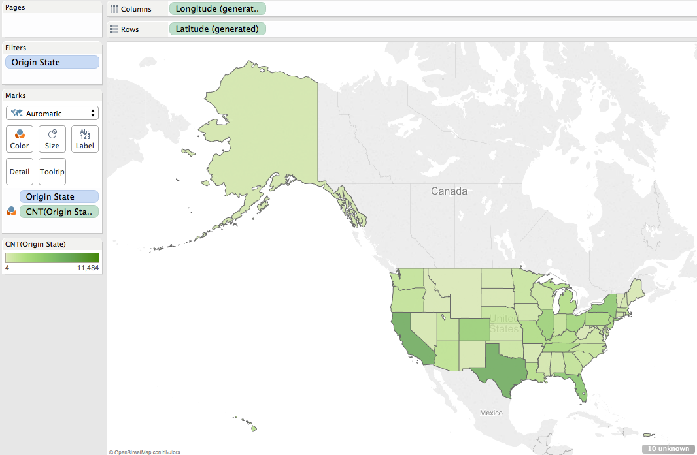

# Report

Using Tableau, create visualization for each question in the report regarding
bird strikes.

# Authors

This report is prepared by
* [Kari Santos](https://github.com/karisantos)
* [Heather Witte](https://github.com/hswitte)
* [Zachary Lamb](https://github.com/ZachLamb)
* [Fadhil Suhendi](https://github.com/fadhilfath)
* [Denis Kazakov](https://github.com/94kazakov)

# Which airlines have the worst luck with birdstrikes in terms of damage caused?
This question was asked by (calebhsu).

The airlines are sorted by sum of total cost. The top row shows that Business was the airline with the largest total cost, over $100M.

# What is the most common flight phase where a birdstrike occurred?
This question was asked by (KevinKGifford).

Approach was the phase with the most incidents, as shown by the largest circle.

# What airports have the most expensive average accident?
This question was asked by (satchelspencer ).

The Airports are sorted by largest average cost. Nice had the highest cost of about $10M, as seen in the first column.

# Which plane strikes the most birds? 
This question was asked by (twagar95).

The B-&737-300, closely followed by the A-320 and the CL-RJ100/200 had the most bird strikes, as depicted by circle size.

# what state had the highest number of bird strikes?
This question was asked by (drewdinger).

Texas, cloesly followed by California has the most birdstrikes. The states are colored the darkest greens in the map. 
