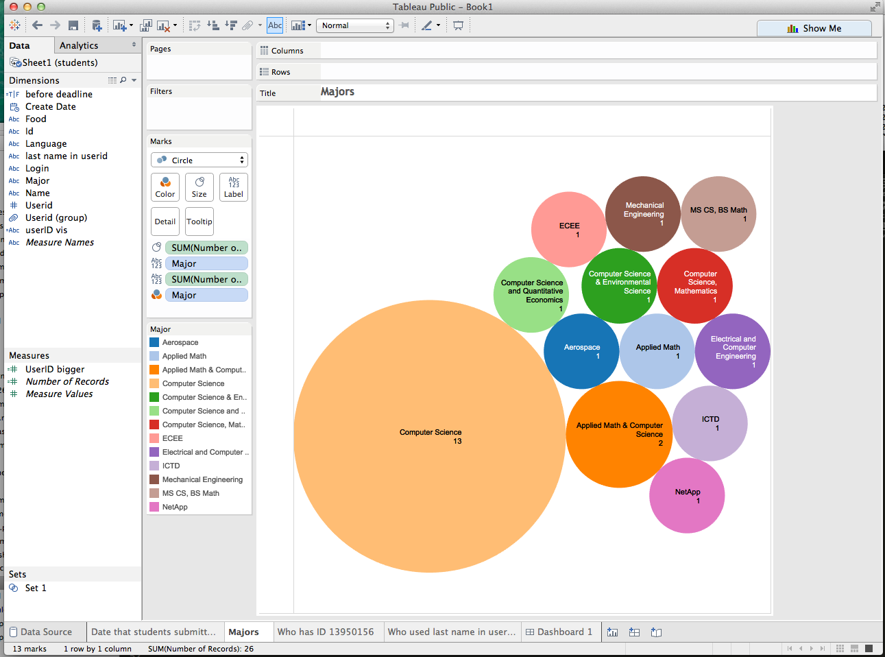

# Tableau Visualization

Tableau is arguably the biggest deal now in terms of data visualization for non-programmers.
Let's pretend you are not a programer. Learn and experience what it is like to make
visualizations using Tableau to answer the same questions about your classmates in our course.

For each of the question, think about what chart you should use to convey your answer and
make your best effort to create something that makes sense to you. There's no right
or wrong. When we meet in the class again, we will set aside time for each team to discuss
and compare the variety of visualization solutions each member has come up with for the
same set of questions. It will be fun!

To include a Tableau visualization in your report, take a screenshot, save it as an image,
put it in the `learning/week2` folder, and replace ``  with
your own image. Please makes sure your screenshot includes the _entire_ Tableau interface
including the controls, widgets ...etc.

# How big the deal Tableau really is?

Tableau had approximately 4,400 customers by the end of 2010 and this increased to 26,000 in 2014.
(http://www.forbes.com/sites/greatspeculations/2015/04/15/a-closer-look-at-tableaus-customer-base-growth/)

Tableau's revenue growth during the past few years has very rapidly passed through the $100 million, $200 million and $300 million revenue thresholds at an extraordinary rate compared with other software and technology companies.  Tableau has a strong position on the Ability to Execute axis of the Leaders quadrant, because of the company's successful "land and expand" strategy that has driven much of its growth momentum.
(http://www.gartner.com/technology/reprints.do?id=1-2ACLP1P&ct=150220&st=sb)

More than 23,000 customer accounts and growing. (http://www.tableau.com/about/customers)

Company’s fifth consecutive year of revenue growth over 75% fueled by 9,100 new customer accounts

Publish Date:
February 19, 2015 (All day)
On the heels of its 2014 earnings announcement, Tableau shared figures on the record growth of its business analytics products. After five years of exponential growth, the company reached $913 million in lifetime revenue – $413 million of which was generated in 2014. With that achievement, Tableau has become one of the fastest growing companies in the fifty-year history of business analytics software. (https://www.tableau.com/about/press-releases/2015/tableau-sees-exponential-growth-tipping-point-year-2014)
# How many students submitted personal information on or before the class deadline of 8/24/15?

The bar chart show how many students submitted comments each day.  The deadline was the end of August 24, 2015, represented by the black vertical line. To get the answer of the question, add the orange bars.  The sum is 22 students. 
# How many students are computer science majors?

13 students are Computer Science majors.  A few others have computer science combined with other majors.

# Who has the user id 13950166?

TJ Romanowski has ID 13950166. His name is in red. To add a little more interesting information, the user IDs, which are correlated to time (the larger the number the more recently issued userID), are sorted from smallest to largest.  And the students are grouped by preferred language.  Python users typically have been using github for longer than other language users.

# Who used their lastname as part of their github user ID?

UserIDs that are green have the lastname in the ID. Red userIDs do not have the lastnames as part of the ID.
