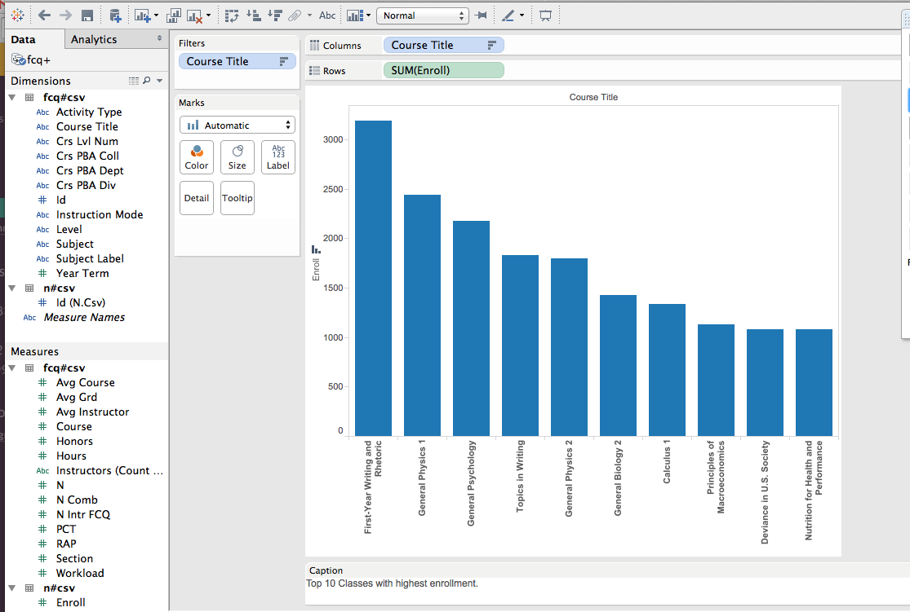
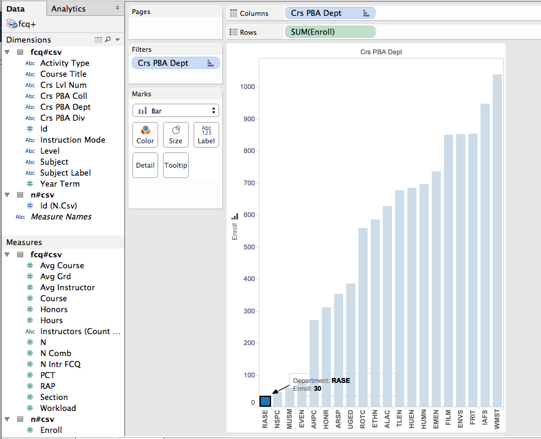
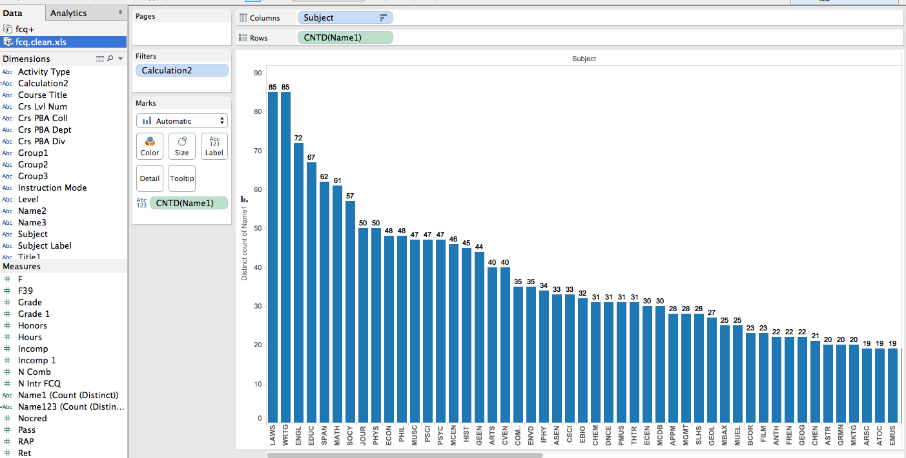
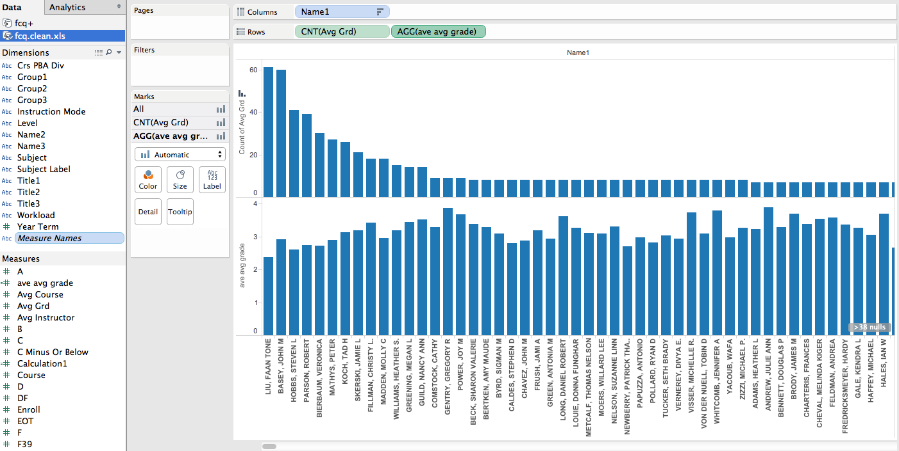
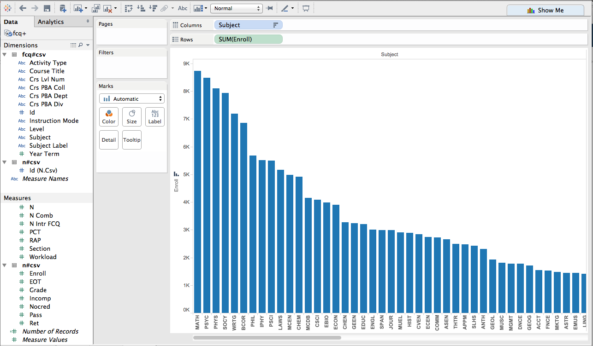

# Visualization

Using Tableau, create visualization for each question in the report. You will
work on this independently just like last week.

To include a Tableau visualization in your report, take a screenshot, save it as an image,
put it in the `learning/week2` folder, and replace ``  with
your own image. Please makes sure your screenshot includes the _entire_ Tableau interface
including the controls, widgets ...etc.

# Import

Data: [fcq.clean.json](https://github.com/bigdatahci2015/book/blob/master/hackathons/fcq/fcq.clean.json)

(a copy of this file is in your book repository already in the directory `hackathons/fcq`)

This dataset is provided to you in the JSON format. Your first task is to figure out
how to transform this JSON file into a format that can be fed into Tableau. As
a junior and senior, you are expected to be able to look around the Internet
to problem solve.

# Which course has the highest enrollment? by Andrew Berumen

The chart shows the class title of the 10 most enrolled classes.  The highest enrolled class is on the left side of graph.
# Which department has the lowest enrollment?  by John Rasely

The department RASE is highlighted on the left side of the bar graph, with an enrollment of 30.
The 20 smallest departments are shown in graph.

# How many instructors have taught each subject? by Kari

The chart shows the number of instructors that have taught each subject.  The height of each bar represents the number of instructors.

# Does the instruction tends to give out higher grades if they teach more classes? or the reverse? by Ming

The top chart shows number of classes each instructor has taught. The bottom graph shows the average grade of the instructors classes. There does not seem to be a trend between teaching many classes and average GPA given out.

# Which subject is most in demand,based on the total number of enrollment?  by Sussant

This graph shows enrollment counts for each subject. The columns are sorted in descending order, so the first column, MATH has the highest enrollment.
